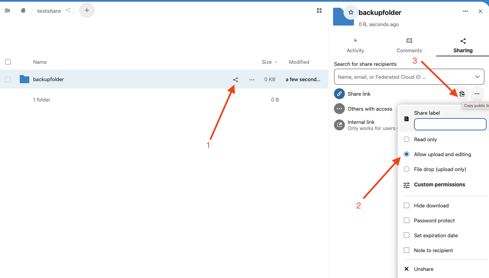

_Einstellungen -> System -> System -> Sicherung/Wiederherstellung_
In den Sicherungseinstellungen kann ein Cloud-Dienst für automatische Sicherungen hinterlegt werden. Die Konfiguration des Cloud-Dienstes wird in diesem Wiki-Beitrag beschrieben.

### Nextcloud
Zunächst einen neuen Ordner erstellen/auswählen, in den die Sicherungen hochgeladen werden sollen.
1. Freigabe erstellen
2. Hochladen erlauben (oder file drop only)
3. Link kopieren

