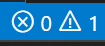
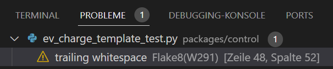
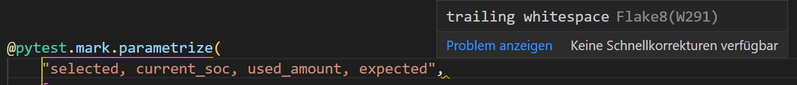
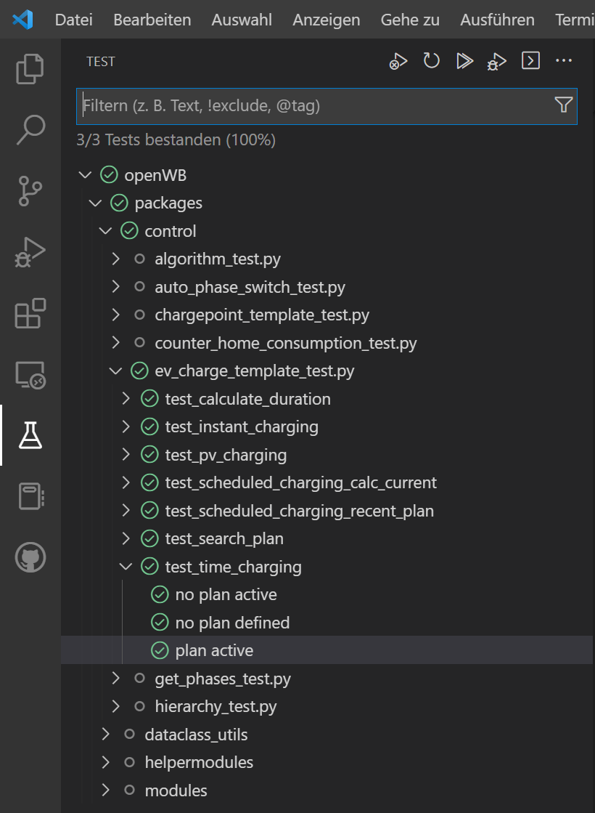

**Wie kann man die eigene Entwicklungsumgebung konfigurieren um bestmöglich mitwirken zu können?**

Bewährt hat sich VSCode https://code.visualstudio.com/, hinzu kommen noch ein paar Plugins. Am einfachsten direkt nach der Installation von VSCode in den Erweiterungen danach suchen und installieren:

* GitHub - für die Codeverwaltung, erstellen von PRs & co
* Flake8 (ich musste aus dem DropDown explizit das prerelease auswählen) - Überprüft die Code-Formatierung von Python direkt im Editor. Ist optional, wird beim Erstellen eines PRs aber im Repo überprüft und der PR geht im Zweifel zurück an euch. 
* Remote Development - ebenfalls optional, erlaubt es aber direkt auf eine Raspbi zu arbeiten. Auch für Live-Debugging & co sehr hilfreich. 
* Remote SSH - benötigt für das Remote Development auf einem Raspbi

Genereller Ablauf, um eigene Änderungen beisteuern zu können:
* Eigenen GitHub Account erstellen
* openWB core Repo(sitory) in den eigenen Account forken, um eine editierbare Version zu erhalten: https://github.com/openWB/core/fork
* Gegen diese eigene Kopie kann nun gearbeitet werden. Hierzu in VSCode in der Kommandozeile oben git clone starten, auf die URL des eigenen Repo zeigen. Diese URL endet auf .git und findet sich in GitHub hinter dem Button Code.
* Es empfiehlt sich unbedingt für Änderungen stets einen separaten Branch zu öffnen, um das nächste Mal nicht wieder die ganzen alten Änderungen mitzuschleifen. Links unten in VSCvode auf den Namen des Branch (master) klicken und einen neuen erstellen.
* Die Änderungen durchführen und testen.
* Wenn alles passt in der Quellcodeverwaltung die geänderten Dateien mit dem '+' auswählen und eine kurze Beschreibung hinzufügen. Mit Klick auf Commit werden die Änderungen in das eigene Repo übertragen.
* Testen. 
* Wenn alles passt, einen PullRequest (PR) gegen das offizielle Repo erstellen: GitHub in VSCode auswählen, rechts neben 'PULL REQUESTS' findet sich ein 'Create Pull Request' - überprüfen ob das Ziel wirklich master in openWB/Core ist, was eigentlich der Fall sein sollte. Änderungen auswählen, auch diese sollten bereits vorselektiert sein, kurze Beschreibung, und PR absetzen.

Hört sich jetzt schlimmer an als es ist, wenn man den Prozess einmal durch hat ist das kein Drama mehr.

Einrichtung Remote Development: 

Hier gibts eine kurze Übersicht: https://www.raspberrypi.com/news/coding-on-raspberry-pi-remotely-with-visual-studio-code/

*hier brauchts noch mehr Details, ggf. ein Screenshot?*

Für Live-Debugging eine Remote-Session starten, openwb2.service beenden und main.py direkt in VSCode über 'Ausführen und Debuggen' starten. Ggf. muss hier einmalig die passende Umgebung (SSH) ausgewählt werden.

**Flake8**

Nach dem Erstellen eines PRs gegen das offizielle Repo werden automatisiert einige Tests durchgeführt, schlagen diese fehl muss der PR korrigiert werden.
Flake8 ist einer dieser Tests und überprüft/forciert saubere Code-Formatierung.

Um nun zu vermeiden, dass man dies unnötig häufig macht, empfiehlt es sich, unbedingt Flake8 direkt selbst in VSCode zu aktivieren und die Fehler und Warnungen zu korrigieren.

Fehler und Warnungen findet man im Tray von VSCode:

In der Ausgabe im Reiter Probleme:

Und auch inline direkt im Editor:

**PyTest**

Neben der Formatierung werden auch automatisierte Funktionstests durchgeführt. Auch diese können in VSCode bereits vor dem Absenden des PRs durchgeführt werden. 
Zu finden sind die Tests links im Navigationsbaum von VSCode. Bei der ersten Nutzung muss noch 'pytest' als Testplattform ausgewählt werden. Anschließend kann man im Navigationsbaum einzelne oder alle Tests starten und überprüfen ob diese erfolgreich waren. Fehler werden direkt im Code der jeweiligen Tests angezeigt um den Test ggf. anpassen zu können.

Um sich das Leben einfach zu machen, sollte man spätestens hier die Variante 'Remote-Development' wählen. Das stellt sicher, dass die notwendigen Module allesamt vorhanden sind.

 