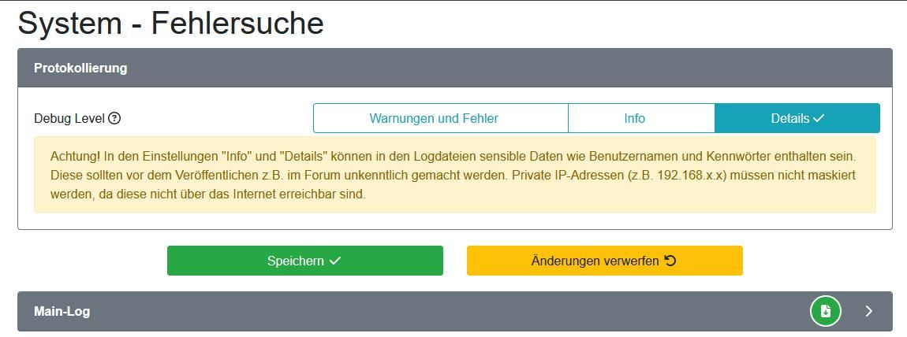
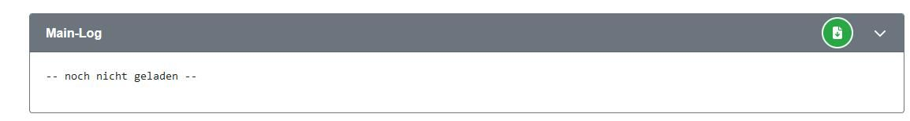

# Fehlersuche

Es kann immer mal passieren, dass etwas nicht wie gedacht funktioniert. Das kann an einem Fehler im Programmcode, an einem Hardwaredefekt oder an einer fehlerhaften oder nicht zu den Gegebenheiten passenden Konfiguration liegen.

Wenn nun eine Funktion nicht wie erwartet ausgeführt wird oder plötzlich ein Fehler auftritt, ist die erste Frage:
> Habe ich vor Kurzem etwas verändert?

Dies betrifft ebenso Änderungen der Einstellungen im Fahrzeug, Wechselrichter (Softwareupdate?)  oder der Hauselektrik. Unter Umständen kann das Problem so schon gelöst werden.

## Wo bekomme ich Hilfe?

### Hardwaresupport

Mit Problemen bei Inbetriebnahme / Anschluss oder Hardwareproblemen mit openWB-Hardware bitte direkt über die Support-Funktion unter System -> Support an openWB wenden (Notfalls auch per Mail an <support@openwb.de>).
Im Forum kann durchaus mal etwas untergehen. Das führt zu Frust und soll nicht sein.

### Forum

Im [Forum](https://forum.openwb.de/index.php) findet man folgende Hilfestellung für Hilfesuchende. Die hier erbetene Herangehensweise dient dazu, den Fehler mit dem für alle niedrigsten Aufwand zu beheben.

> Bitte keine Mehrfach-Meldung per Mail, Support-Ticket und Forum.
Das spart auf unserer Seite Supportzeit und bringt erfahrungsgemäß keine Beschleunigung des Vorgangs.
Bitte bei Problemen immer einen Logauszug posten:

> Dazu unter System->Fehlersuche das Debuglevel auf Details stellen und mindestens zwei komplette Durchläufe von ``# *** Start***`` bis ``# ***Start***`` aus dem Main-Log kopieren, während das Problem auftritt. Sensible Daten wie Benutzernamen und Kennwörter unkenntlich machen.
Logauszüge bitte als Codeblock posten (Schaltfläche "</>" über dem Editor-Fenster).
Bei Problemen mit dem internen Ladepunkt zusätzlich einen Auszug aus dem Log des internen Ladepunkts, bei Problemen mit dem Soc aus dem Soc-Log posten.
Bei Problemen mit dem UI/Darstellung bitte ein Theme verwenden, das von openWB gepflegt wird (wird bei der Themeauswahl angezeigt).

> Screenshots ersetzen keinen Logauszug!
Für Beiträge wie "Funktion XY geht nicht mehr! Woran kann das liegen?" ohne Logs gibt es von uns keine Hilfestellung.

Formuliert Eure Frage freundlich, beschreibt was ihr tun wolltet und was anstelle dessen passiert ist. Weiterhin ist die verwendete Version von OpenWB wichtig. Diese findet ihr unter _Einstellungen -> System -> System_ im Feld _Versionsinformationen / Aktualisierungen_.
Da es schon Wechselwirkungen mit anderen Smarthome-Systemen gegeben hat, erwähnt ggf. weitere im Heimnetzwerk laufende SmartHome-Systeme.

### Log-Erstellung

In der Standard-Einstellung des Logs werden nur Warnungen & Fehler erfasst.  Außerdem wird bei einem Neustart der openWB der Fehlerlog gelöscht.

Um aussagekräftige Logs zu erzeugen, müssen Log-Dateien im Debug-Modus erstellt werden. Hierzu ist folgende Schaltfläche zu aktivieren:

Aufgrund des detaillierten Loggings, ist die Dauer der Aufnahme ca. auf die letzten zwei Stunden begrenzt.  Beachtet also, dass ihr sich der Fehler innerhalb des aufgezeichneten Abschnitts befindet.
Dann ist in den meisten Fällen das Main.log, aufzuklappen und mit der grünen Schaltfläche zu aktualisieren. Der entsprechende Auszug kann nun in eine Textdatei oder direkt in die Nachricht im Forum kopiert werden.

