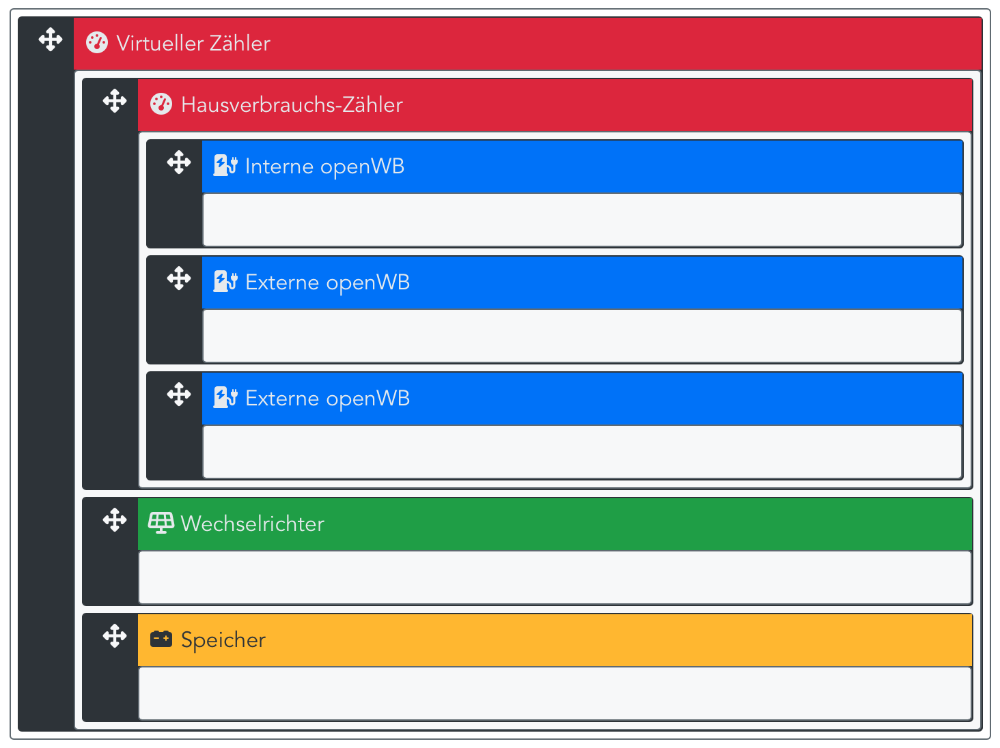
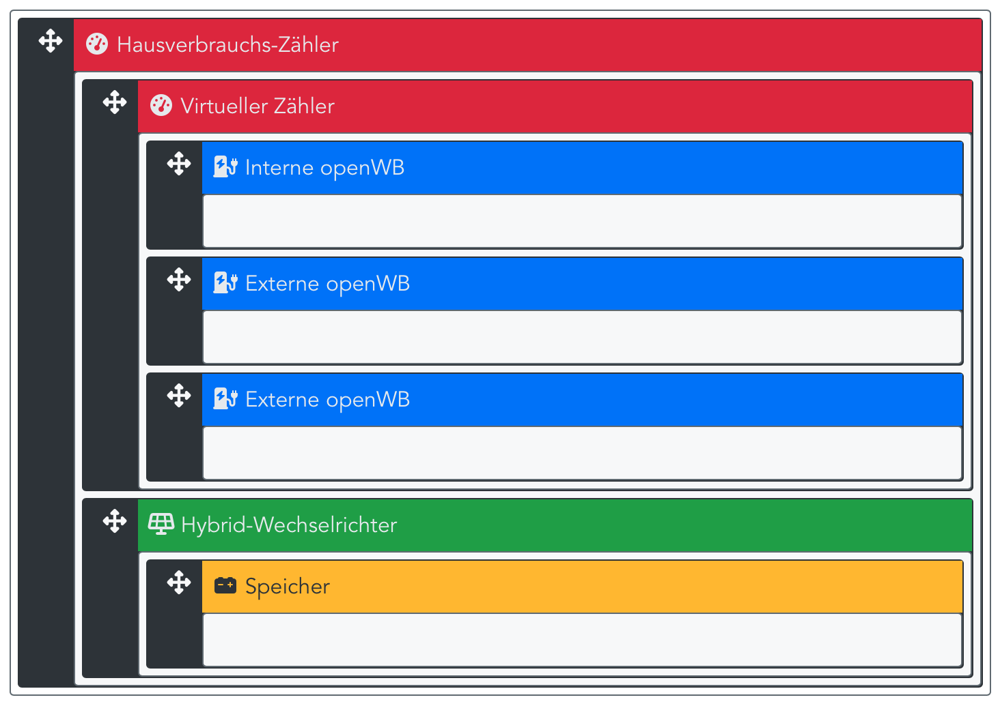
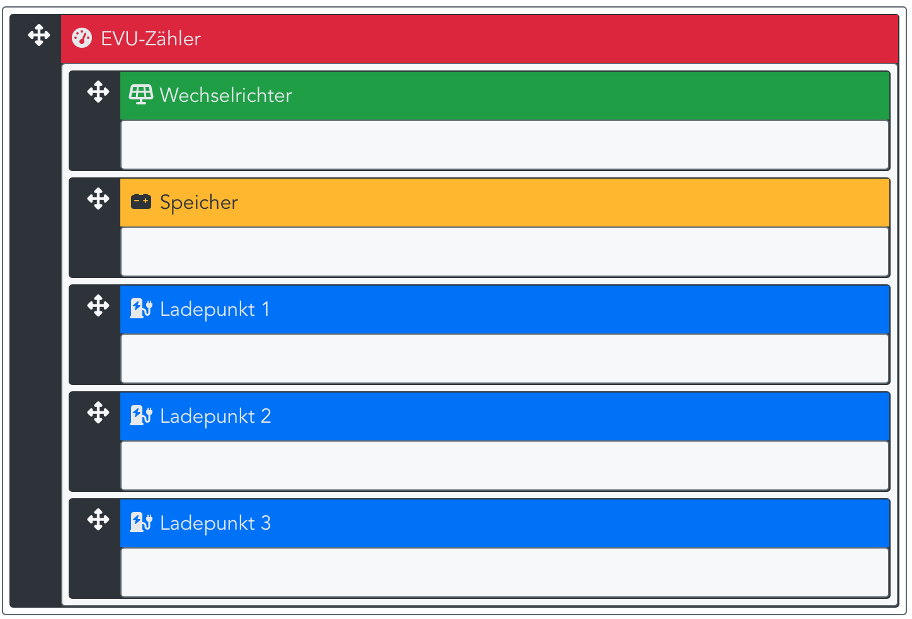

Einige Zähler, wie zB Solar-Log und Kostal Plenticore, werden im Hausverbrauchs-Zweig und nicht am EVU-Punkt installiert. Die für die Reglung erforderlichen Werte des EVU-Punkts werden mit einem virtuellen Zähler ermittelt. Dazu ein Virtuelles Gerät mit einem virtuellen Zähler anlegen. Die Komponenten müssen in der Hierarchie wie in den Abbildungen angeordnet werden:

Misst der Zähler den Hausverbrauch, ergibt sich folgende Anordnung:

Misst der Zähler den Hausverbrauchs und ist ein Hybrid-Wechselrichter vorhanden, ergibt sich folgende Struktur:

Ist der Zähler wie üblich am EVU-Punkt installiert und misst den gesamten Verbrauch/Einspeisung, muss die Struktur wie folgt aussehen:

