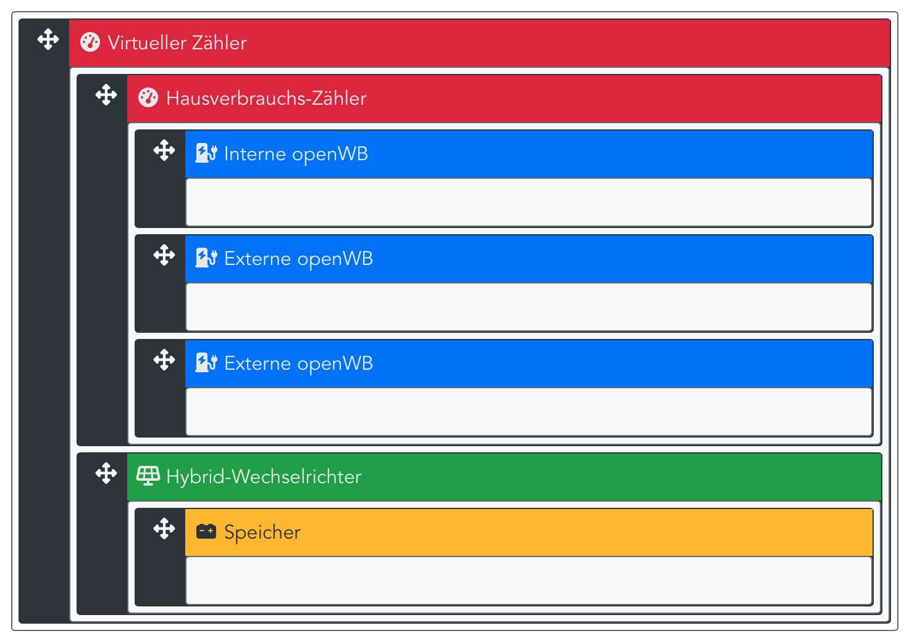

Einige Zähler, wie zB Solar-Log und Kostal Plenticore, werden im Hausverbrauchs-Zweig und nicht am EVU-Punkt installiert. Die für die Reglung erforderlichen Werte des EVU-Punkts werden mit einem virtuellen Zähler ermittelt. Dazu ein Virtuelles Gerät mit einem virtuellen Zähler anlegen. Die Komponenten müssen in der Hierarchie wie in der Abbildung angeordnet werden:

Ist ein Hybrid-Wechselrichter vorhanden, ergibt sich folgende Struktur:

