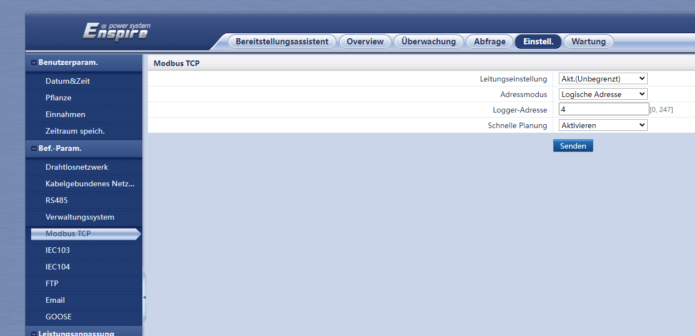

Im Smartlogger3000a müssen folgende Einstellungen festgelegt werden:

1. Zunächst unter Einstell.-> Bef.-Param. -> Modbus TCP Folgende Einstellungen festlegen:
    - Leitungseinstellungen: Akt.(Unbegrenzt)
    - Addressmodus: Logische Addresse
    - Logger-Addresse: z.B.4 (Muss eine freie ModBus ID sein, logische Addresse 2tes Bild.)
    - Schnelle Planung: Aktivieren

2. Unter Wartung->Geräte-Mgmt.-> Geräte Liste kann man jetzt die logische Adresse der einzelnen Geräte ablesen. Diese wird dann in der openWB in der Einstellung ModbusID eingetragen.
    
3. in den Einstellungen der openWB das Modul Huawei Smartlogger auswählen.
4. Jetzt muss man die IP des Smartloggers und den Port 502 eintragen, außer dieser wurde geändert.
5. Jetzt die passenden Komponenten hinzufügen und die jeweilige ModbusID eintragen.
6. Zum Schluss auf Speichern drücken und unter dem Lastmanagement die passende Anordnung wählen.
    
