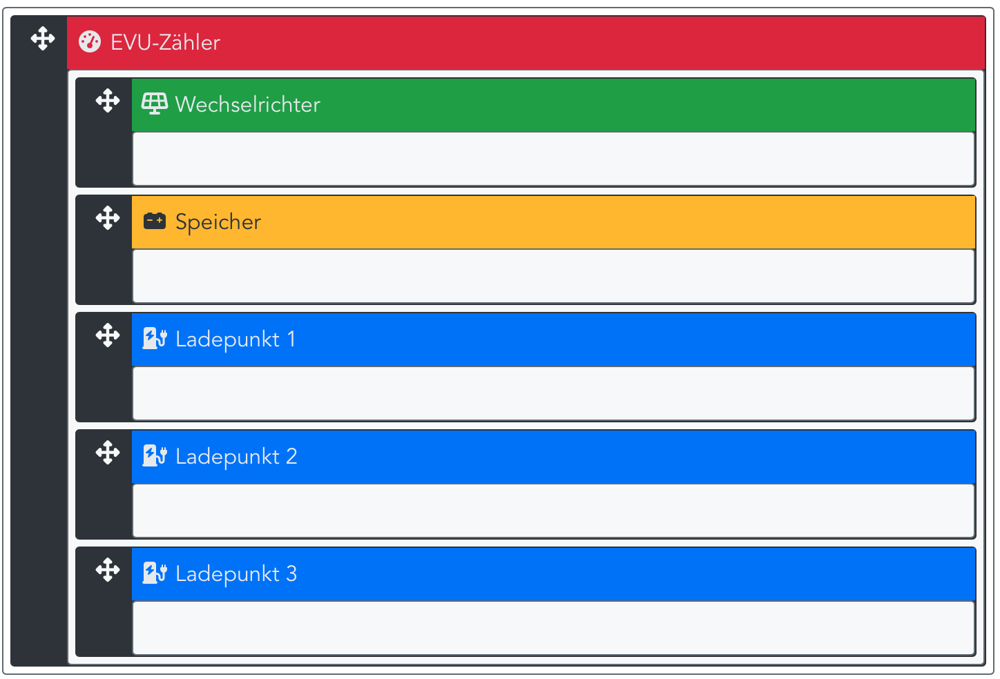

Bei Hybrid-Systemen ist ein DC- Speicher an den Wechselrichter angeschlossen. Bei den meisten Herstellern wird dann die Wechselrichter-Leistung anstelle der PV-Leistung ausgegeben. Auch die Zählerstände werden miteinander verrechnet.

Wechselrichter-Leistung: Summe aus PV- und Speicher-Leistung, die der Wechselrichter ins Hausnetz abgibt.
PV-Leistung: Auf dem Dach erzeugte Leistung.

In openWB wird die PV-Leistung ausgegeben. Wenn in der Struktur der Speicher hinter dem Wechselrichter angeordnet ist, berechnet die openWB aus der Wechselrichter- und Speicher-Leistung den Wert für die PV-Leistung.

Nicht alle Hersteller geben bei Hybrid-Systemen die Wechselrichter-Leistung aus. Daher können wir keine allgemein gültige Empfehlung zur Konfiguration der Struktur geben.
Die Struktur muss wie in der ersten Abbildung angeordnet werden, wenn die PV-Leistung um die Ladeleistung des Speichers zu niedrig ist. (Achtung: Auch der Hausverbrauch stimmt dann nicht, da dieser aus den gemessenen Größen berechnet wird.)

Hybrid-System, wenn die Wechselrichter-Leistung ausgegeben wird:

Hybrid-System, wenn die PV-Leistung ausgegeben wird:

