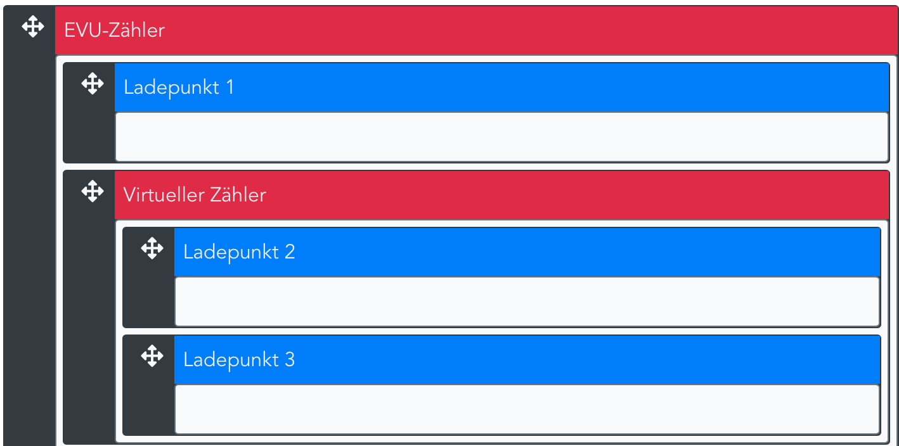

Das Lastmanagement steuert die Freigabe des Ladestroms, wenn nicht alle Ladepunkte mit voller Leistung laden könnnen. Begrenzende Faktoren könnnen der Hausanschluss, Sicherungen oder Zuleitungen sein.

Die Priorisierung der Ladepunkte beschreibt der Hilfetext unter _Einstellungen -> Konfiguration -> Fahrzeuge -> Ladeprofil-Vorlage -> \*beliebige Vorlage\* -> Aktiver Lademodus_.
Das Lastmanagement funktioniert dreistufig (ab Version 1.99.101.1):
1. Zuteilung des Fahrzeug-Mindeststroms unter Berücksichtigung des Lastmanagements: Der Ladepunkt mit der höchsten Priorisierung erhält zuerst eine Stromzuteilung.
2. Zuteilung des Lademodus-Sollstroms unter Berücksichtigung des Lastmanagements: Der verfügbare Strom wird unter allen Ladepunkten mit der gleichen Priorisierung aufgeteilt.
3. Zuteilung des Überschusses (falls vorhanden und Lademodus PV oder Zielladen) unter Berücksichtigung des Lastmanagements: Der verfügbare Strom wird unter allen Ladepunkten mit der gleichen Priorisierung aufgeteilt.

### Lastmanagement mit kaskadierten Zählern

_Einstellungen -> Konfiguration -> Geräte und Komponenten_  
Unter _Geräte und Komponenten_  müssen zunächst alle Zähler in der Anlage kofniguriert werden (bitte den Hilfetext in der Benutzeroberfläche zum Anlegen von Geräten und Komponenten beachten). Wenn an einer Zuleitung nur Ladepunkte oder Verbraucher mit einer festen Leistung angeschlossen sind und kein physischer Zähler verbaut ist, kann auch ein virtueller Zähler angelegt werden (Loadsharing). Ob ein Zähler als EVU-Zähler oder Zwischenzähler arbeitet, ergibt sich durch die Anordnung in der Struktur.

_Einstellungen -> Konfiguration -> Lastmamangement -> Struktur_  
Bei der Konfiguration in der Abbildung sorgt das Lastmanagement dafür, dass Ladepunkt 2 und 3 gemeinsam nicht die maximale Stromstärke des Zwischenzählers "Virtueller Zähler" überschreiten. Außerdem berechnet das Lastmanagement die Ladeströme so, dass der virtuelle Zähler, Ladepunkt 1 und die am EVU-Zähler gemessene Stromstärke und Leistung die vorgegebene maximale Leistung und Stromstärke des EVU-Zählers einhalten.

### Virtuelle Zähler
Ein virtueller Zähler addiert alle Komponenten, die in der Hierachie unterhalb dessen angeordnet sind, und die Leistung, die in den Einstellungen unter _zusätzlicher Verbrauch_ angegeben ist. Wenn sich mehrere Ladepunkte eine Zuleitung teilen (Loadsharing), muss ein virtueller Zähler konfgiuriert werden und in der Hierachie über den beiden Ladepunkten angeordnet werden. In der Abbildung sind das Ladepunkt 2 und 3.