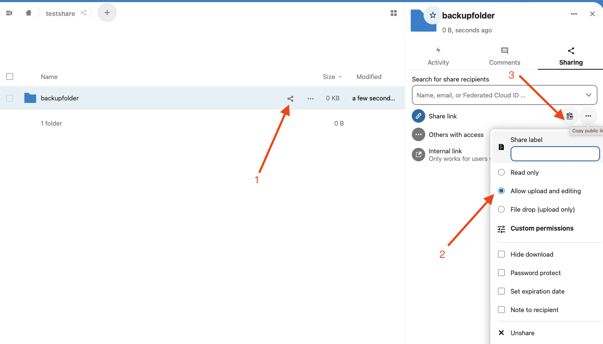

Zunächst einen neuen Ordner erstellen/auswählen, in den die Sicherungen hochgeladen werden sollen.

1. Freigabe erstellen
2. Hochladen erlauben (oder file drop only)
3. Link kopieren

Diesen Link in das Feld Cloud-URL in der openWB unter System -> Datenverwaltung -> Automatische Sicherung in einen Cloud-Dienst eintragen und Benutzername sowie Passwort freilassen (speichern drücken nicht vergessen)!

Alternativ:
Falls es Probleme gibt kann der Link auch folgendermaßen eingetragen werden:
Freigabelink z.B.: https://kim.nl.tab.digital/s/tUbHHrEdGltSRgx

Wahl: BackupCloud: NextCloud
Unterpunkt: Einstellungen für Backup-Cloud Modul "NextCloud"
Cloud-URL: <https://mydomain.de> z.B.: <https://kim.nl.tab.digital> OHNE /s/ oder /
Benutzername: dein shared token, also z.B.: tUbHHrEdGltSRgx
Passwort: kann leergelassen oder irgendetwas eingetragen werden, spielt keine Rolle

Beide Varianten wurden getestet und funktionieren.

Stand 10. April 2024
