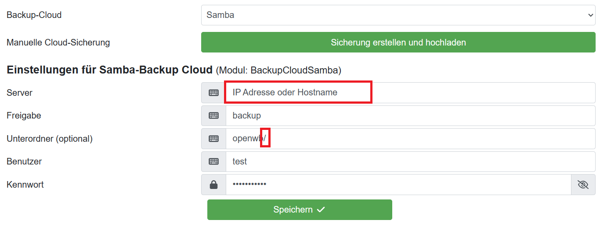

Zunächst einen neuen Ordner erstellen/auswählen, in den die Sicherungen hochgeladen werden sollen.

Nachfolgende Schritte müssen auf dem Bereitstellenden system gemacht werden

1. SMB Freigabe erstellen (Auf NAS etc.)
2. User einrichten und berechtigen - R/W

Nachfolgende Schritte müssen in openWB gemacht werden.

1. IP Adresse oder Name (Am besten FQDN) im Feld Server hinterlegen
    * IP: z.B 192.168.178.1
    * Name z.B. mein-server
    * FQDN z.B mein-server.fritz.box
2. Share angeben in dem das Backup gespeichert werden soll
3. Optional können ein bis n Unterordner angegeben werden. Diese müssen immer mit / getrennt werden und auch am Ende muss ein / stehen
    * Beispiel: test/ oder aber test1/test2/test/
4. Benutzer und Passwort in die jeweilegen Felder eintragen

Ergänzungen:
Bei manchen Systemen kann es notwendig sein das Mindest-SMB-Protokoll auf SMB2 zu setzen.

Anleitung für Samba Server auf einem Raspberry Pi (z.B.: Stand alone)

1. Installieren von Samba
sudo apt-get update
sudo apt-get install samba samba-common smbclient
2. Prüfen ob Samba läuft
sudo service smbd status
sudo service nmbd status
3. Samba User anlegen
sudo useradd testsmb
Optional:
4. Falls users nicht vorhanden: sudo groupadd users
check mit getent group
5. Hinzufügen des Samba Users zur Gruppe users
sudo usermod -aG users testsmb
6. Ordner anlegen in /home
sudo mkdir smb
sudo mkdir smb/testsmb
sudo mkdir smb/testsmb/test
7. Besitzer ändern
sudo chown testsmb /home/smb/testsmb
sudo chown testsmb /home/smb/testsmb/test
8. Konfigurationsdatei von Samba sichern
sudo cp /etc/samba/smb.conf /etc/samba/smb.conf_backup
Konfigurationsdatei smb.conf anpassen
sudo nano /etc/samba/smb.conf
[global]
 workgroup = WORKGROUP
 security = user
 encrypt passwords = yes
 client min protocol = SMB2
 client max protocol = SMB3
 bis zum Ende der Datei scrollen und folgende Eintragungen vornehmen:
[testsmb]
  comment = Samba-Test-Share
  valid users = testsmb
  path = /home/smb/testsmb
  read only = no
9. Testen ob die smb.conf noch funktioniert
testparm
10. Benutzer aktivieren
sudo smbpasswd -a testsmb
New SMB password: testSMB
Retype new SMB password: testSMB
Optional
11. Sichergehen, dass Benutzer aktiviert ist
sudo smbpasswd -e testsmb
12. IP-Adresse des Raspberry Pis notieren
ifconfig -> z.B.: 192.168.43.81
13. Neustart von Samba nach Änderung der Konfiguration
sudo service smbd restart
sudo service nmbd restart

Der Samba Dienst ist nun eingerichtet und konfiguriert. Alternativ können auch andere Benutzergruppen mit anderen Berechtigungen konfiguriert werden.

In openWB unter System -> Datenverwaltung -> Sicherung / Wiederherstellung unter Automatische Sicherung in einen Cloud-Dienst als Backup-Cloud Samba auswählen und folgende Einstellungen für Backup-Cloud Modul "Samba" eintragen:
Server: IP_Adresse des Raspberry Pis z.B.: 192.168.43.81
Freigabe: testsmb
Unterordner: test/
Benutzer: testsmb
Kennwort: testSMB

Speichern drücken und testen durch klicken auf Sicherung erstellen und hochladen

Stand 08. April 2024
