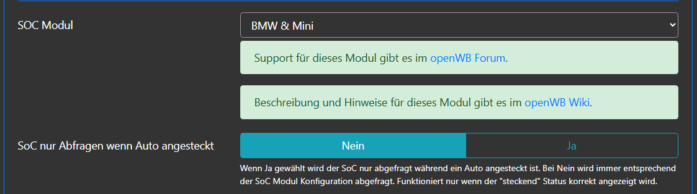
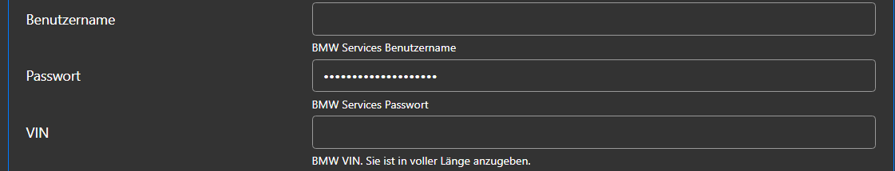
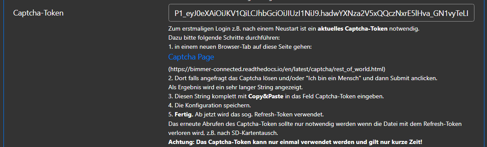
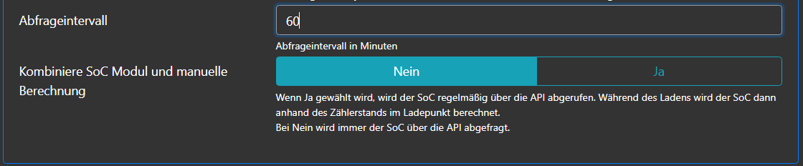
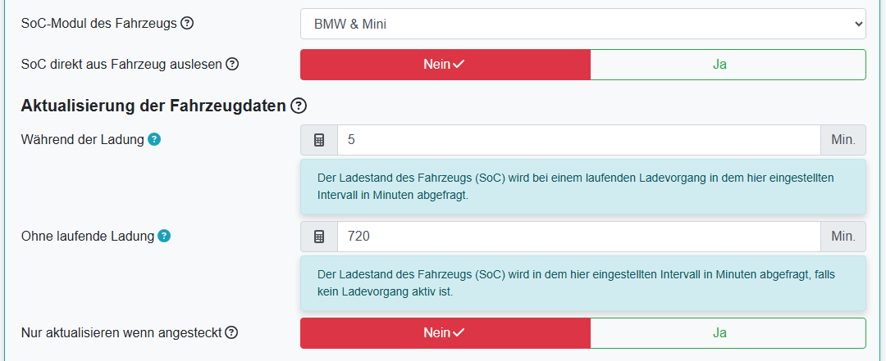
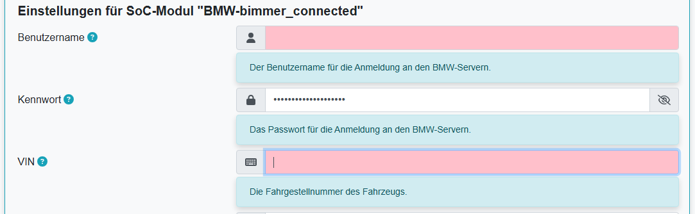
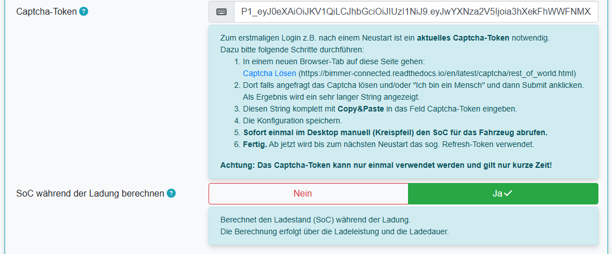

# SoC-Modul BMW & Mini

Das Modul gibt es in openWB 1.x und 2.x; es funktioniert in beiden Systemen ähnlich.

## Konfiguration in openWB 1.x

Die Konfiguration des SoC-Moduls erfolgt in Einstellungen - Modulkonfiguration - Ladepunkte:

## Konfiguration in openWB 2.x

Die Konfiguration des SoC-Moduls erfolgt in Einstellungen - Konfiguration - Fahrzeuge:

Die Hilfe zu den Feldern kann in openWB 2.x durch Click auf das (?) angezeigt werden.

In der Konfiguration des SoC-Moduls BMW & Mini ist Folgendes einzugeben:

- SoC-Modul: BMW & Mini
- Intervalle zur Aktualisierung der Fahrzeugdaten
- Auswahl: Nur Aktualisieren wenn angesteckt
- Benutzername des Connected-Drive Accounts
- Kennwort des Benutzers
- VIN des Fahrzeuges
- Captcha-Token
- Auswahl: SoC-Berechnung während des Ladens

Das Captcha-Token muss durch Lösen eines Captcha ermittelt werden.

Nach Eingabe des Captcha-Token und Sichern der Einstellung muss der SoC für das Fahrzeug sofort abgerufen werden. Dies geschieht mittels des Kreispfeils neben der SoC-Anzeige auf der Hauptseite.

Falls das nicht auf Anhieb klappt, muss es wiederholt werden.

## Hinweise
Nach Neustart bzw. Änderung der LP-Konfiguration werden im EV-Soc-Log Fehler ausgegeben (permission oder fehlende Datei).

    Diese Fehler sind normal und können ignoriert werden. Leider wird im Debug Mode 0 keine Positiv-Meldung ausgegeben.
    Empfehlung:
    - In Einstellungen - System - Fehlersuche bzw. Debugging dies einstellen: Debug Mode 1/Regelwerte bzw. Info
    - dann einen manuellen SOC-Abruf durchführen (im Dashboard auf Kreispfeil klicken).
    - danach sollte im EV-SOC-Log eine Zeile ähnlich dieser kommen:

        `2023-02-12 11:57:14 INFO:soc_bmwbc:Lp1 SOC: 61%@2023-02-12T11:53:20`

        Diese Zeile zeigt folgende Information:

        `2023-02-12 11:57:14       - Timestamp des SOC-Abrufs`

        `INFO                      - Debug Level INFO`

        `soc_bmwbc                 - SOC-Modul`

        `Lp1                       - Ladepunkt`

        `SOC: 61%                  - SOC Stand`

        `@2023-02-12T11:53:20      - Timestamp des Updates vom EV zum VW Cloud-Server`

Falls diese Schritte nicht zum Erfolg führen, das Problem im [Support-Seite im openWB Forum](https://forum.openwb.de/viewtopic.php?t=4870) posten mit Angabe relevanter Daten
    - oWB SW Version
    - oWB gekauft oder selbst installiert
    - wenn selbst installiert: welches OS(Stretch/Buster)
    - welches Fahrzeug
    - falls vorhanden Angaben über Firewall, VPN, etc., also Appliances, die den Internetzugang limitieren könnten
    - relevante Abschnitte der Logs, vor allem Fehlermeldungen, als CODE-blocks (</>).

Das SoC-Log mit evtl. Fehlermeldungen kann wie folgt eingesehen werden:
  - openWB 1.x (Status - EV SoC Log)
  - openWB 2.x (Einstellungen - System - Fehlersuche)

