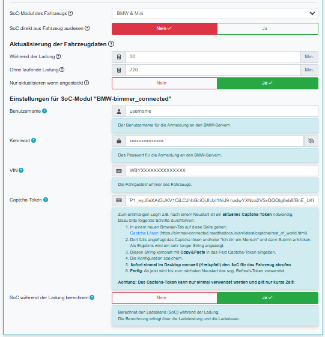

# SoC-Modul BMW & Mini

Das Modul gibt es in openWB 1.9 und 2.x; es funktioniert in beiden Systemen ähnlich.

Die Konfiguration des SoC-Moduls erfolgt in der Konfiguration des Fahrzeuges:

Die Hilfe zu den Feldern kann durch Click auf das (?) angezeigt werden.

In der Konfiguration des SoC-Moduls BMW&Mini ist Folgendes einzugeben:

- SoC-Modul: BMW & Mini
- Intervalle zur Aktualisierung der Fahrzeugdaten
- Auswahl: Nur Aktualisieren wenn angesteckt
- Benutzername des Connected-Drive Accounts
- Kennwort des Benutzers
- VIN des Fahrzeuges
- Captcha-Token
- Auswahl: SoC-Berechnung während des Ladens

Das Captcha-Token muss durch Lösen eines Captcha ermittelt werden.

Nach Eingabe des Captcha-Token und Sichern der Einstellung muss der SoC für das Fahrzeug sofort abgerufen werden. Dies geschieht mittels des Kreispfeils neben der SoC-Anzeige auf der Hauptseite.

Falls das nicht auf Anhieb klappt, muss es wiederholt werden.

Im SoC-Log (Einstellungen - System - Fehlersuche) können evtl. Fehlermeldungen eingesehen werden.

Bei Fragen, Problemen, Kommentaren: [Support-Seite im openWB Forum](https://forum.openwb.de/viewtopic.php?t=4870)
