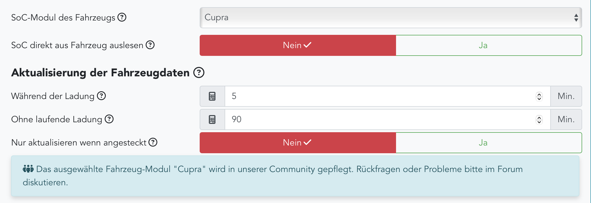
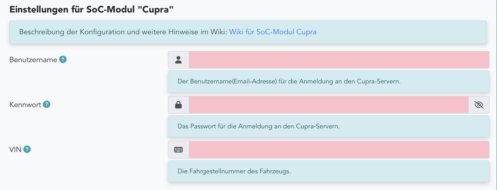

# SoC-Modul Cupra

Das SoC-Modul Cupra gibt es in openWB 2.x.

## Konfiguration

Die Konfiguration erfolgt im Bereich Einstellungen - Konfiguration - Fahrzeuge:

## Hinweise

Für nicht-Cupra Fahrzeuge (Audi, Skoda, VW, etc.) funktioniert das Modul nicht.

Erfolgreich getestet u.a. für folgende Fahrzeuge: Cupra Born.

**Wichtig für alle Fahrzeuge:**
Es muss ein aktives Konto im Seat ID Portal vorhanden sein und die "My SEAT App" muss eingerichtet sein. Es muss explizit die "My SEAT App" eingerichtet werden und nicht die "My CUPRA App".

**WICHTIG:**
Seat/Cupra ändert gelegentlich die Bedingungen für die Nutzung der Online-Services.

Diese müssen bestätigt werden. Wenn der SOC-Abruf plötzlich nicht mehr funktioniert, VOR dem Posten bitte Schritt 1 ausführen.

Bei Problemen zunächst bitte diese Schritte durchführen:

1. sicherstellen, dass auf dieser Seat-Seite alle Einverständnisse gegeben wurden.

    <https://seatid.vwgroup.io/landing-page>

    In einigen Fällen wurden die Einverständnisse gegeben und trotzdem funktionierte die Abfrage nicht.
    Hier hat folgendes Vorgehen geholfen: Im Seat Konto das Land temporär umstellen, d.h.
    - auf ein anderes Land als das eigene ändern
    - sichern
    - zurück auf das eigene Land ändern
    - sichern.

2. Nach einem manuellen SOC-Abruf (Kreispfeil hinter dem SOC klicken) auf der Status - Seite EV-SOC Log und Debug log auf Fehler kontrollieren

3. Falls im Ev-Soc Log Fehler 303 (unknown redirect) gemeldet wird:
    - Ursache 1: Bestimmte Sonderzeichen im Passwort funktionieren nicht mit dem Modul. Bitte das Passwort auf eines ohne Sonderzeichen ändern und testen.
    - Ursache 2: Falsche Email, Passwort oder VIN eingegeben. Alle 3 löschen, speichern, neu eingeben, speichern und testen.

4. Falls eine Firewall im Spiel ist: Es gab einzelne Probleme beim Internet-Zugriff der openWB auf Python Archive und Fahrzeug-Server wenn IPV6 aktiv ist.

5. Nach Neustart bzw. Änderung der LP-Konfiguration werden im EV-Soc-Log Fehler ausgegeben (permission oder fehlende Datei).

    Diese Fehler sind normal und können ignoriert werden. Leider wird im Debug Mode 0 keine Positiv-Meldung ausgegeben.
    Empfehlung:
    - In Einstellungen - System - Fehlersuche dies einstellen: Debug Level/Details
    - dann einen manuellen SOC-Abruf durchführen (im Dashboard auf Kreispfeil klicken).
    - danach sollte im EV-SOC-Log eine Zeile ähnlich dieser kommen:

        `2023-02-12 11:57:14 INFO:soc_skoda:Lp1 SOC: 61%@2023-02-12T11:53:20`

        Diese Zeile zeigt folgende Information:

        `2023-02-12 11:57:14` *- Timestamp des SOC-Abrufs*

        `INFO` *- Debug Level INFO*

        `soc_skoda` *- SOC-Modul*

        `Lp1` *- Ladepunkt*

        `SOC: 61%` *- SOC Stand*

        `@2025-02-12T11:53:20` *- Timestamp des Updates vom EV zum Seat Cloud-Server*

6. Falls diese Schritte nicht zum Erfolg führen, das Problem im [Support Thema](https://forum.openwb.de/viewforum.php?f=12) mit Angabe relevanter Daten posten
    - oWB SW Version
    - oWB gekauft oder selbst installiert
    - wenn selbst installiert: welches OS(Stretch/Buster)
    - welches Fahrzeug
    - falls vorhanden Angaben über Firewall, VPN, etc., also Appliances, die den Internetzugang limitieren könnten
    - relevante Abschnitte der Logs, vor allem Fehlermeldungen, als CODE-blocks (</>).

Das SoC-Log mit evtl. Fehlermeldungen kann wie folgt eingesehen werden:

- Einstellungen - System - Fehlersuche
