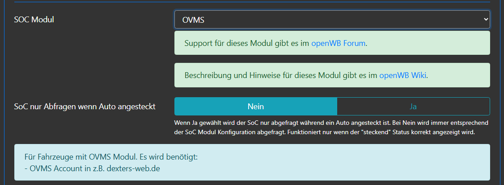
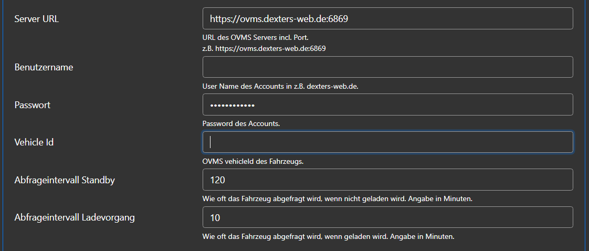
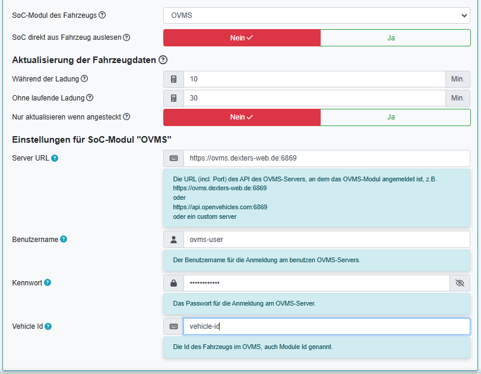

# SoC-Modul OVMS

Das OVMS-Modul im Fahrzeug sendet je nach Ausführung die Daten über Mobilnetz und/oder WLAN an den OVMS-Server (z.B. ovms.dexters-web.de). 
Die OVMS Smartphone-Apps (Android/ios) verbinden sich mit dem gewählten OVMS-Server.

Das SoC-Modul holt die Daten auch vom OVMS Server.

Das OVMS SoC-Modul ist in openWB 1.x und 2.x vefügbar.

Das SoC-Modul OVMS wird wie folgt im Fahrzeug konfiguriert:

## Konfiguration in openWB 1.x

Die Konfiguration des SoC-Moduls erfolgt in Einstellungen - Modulkonfiguration - Ladepunkte:

## Konfiguration in openWB 2.x

Die Konfiguration des SoC-Moduls erfolgt in Einstellungen - Konfiguration - Fahrzeuge:

Die Hilfe zu jedem Feld kann in 2.x durch Click auf das (?) angezeigt werden!

Nach den allgemeinen Einstellungen ist in den speziellen Einstellungen des SoC-Moduls OVMS Folgendes einzutragen:

- Server URL(incl. Port, z.B. `https://ovms.dexters-web.de:6869`)
- User Id des Accounts im OVMS-Server
- Passwort des Accounts
- VehicleId des Fahrzeuges (wird bei der Einrichtung des OVMS-Moduls vergeben)
- Abfrage-Intervall wenn nicht geladen wird
- Abfrage-Intervall wenn geladen wird.

## Hinweise

Nach Neustart bzw. Änderung der LP-Konfiguration werden im EV-Soc-Log Fehler ausgegeben (permission oder fehlende Datei).

Diese Fehler sind normal und können ignoriert werden. Leider wird im Debug Mode 0 keine Positiv-Meldung ausgegeben.

Empfehlung:

- In Einstellungen - System - Fehlersuche bzw. Debugging dies einstellen: Debug Mode 1/Regelwerte bzw. Info
- dann einen manuellen SOC-Abruf durchführen (im Dashboard auf Kreispfeil klicken).
- danach sollte im EV-SOC-Log eine Zeile ähnlich dieser kommen:

        `2023-02-12 11:57:14 INFO:soc_ovms:Lp1 SOC: 61%@2023-02-12T11:53:20`

        Diese Zeile zeigt folgende Information:

        `2023-02-12 11:57:14       - Timestamp des SOC-Abrufs`

        `INFO                      - Debug Level INFO`

        `soc_ovms                 - SOC-Modul`

        `Lp1                       - Ladepunkt`

        `SOC: 61%                  - SOC Stand`

        `@2023-02-12T11:53:20      - Timestamp des Updates vom EV zum VW Cloud-Server`

Falls diese Schritte nicht zum Erfolg führen, das Problem im [Support-Seite im openWB Forum](https://forum.openwb.de/viewtopic.php?t=9278) posten mit Angabe relevanter Daten
    - oWB SW Version
    - oWB gekauft oder selbst installiert
    - wenn selbst installiert: welches OS(Stretch/Buster)
    - welches Fahrzeug
    - falls vorhanden Angaben über Firewall, VPN, etc., also Appliances, die den Internetzugang limitieren könnten
    - relevante Abschnitte der Logs, vor allem Fehlermeldungen, als CODE-blocks (</>).

Das SoC-Log mit evtl. Fehlermeldungen kann wie folgt eingesehen werden:
  - openWB 1.x (Status - EV SoC Log)
  - openWB 2.x (Einstellungen - System - Fehlersuche)

