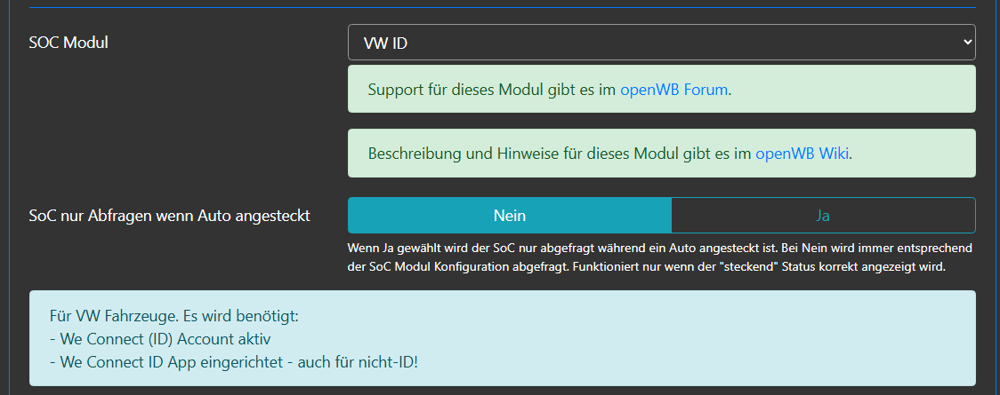
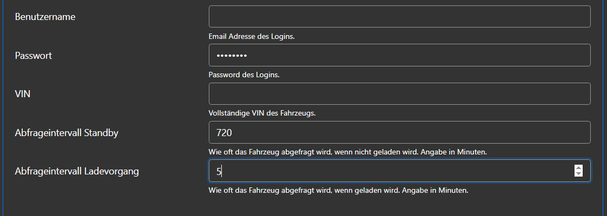
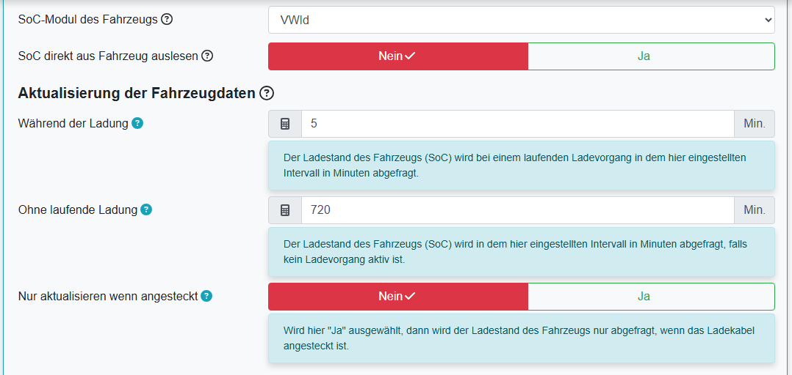
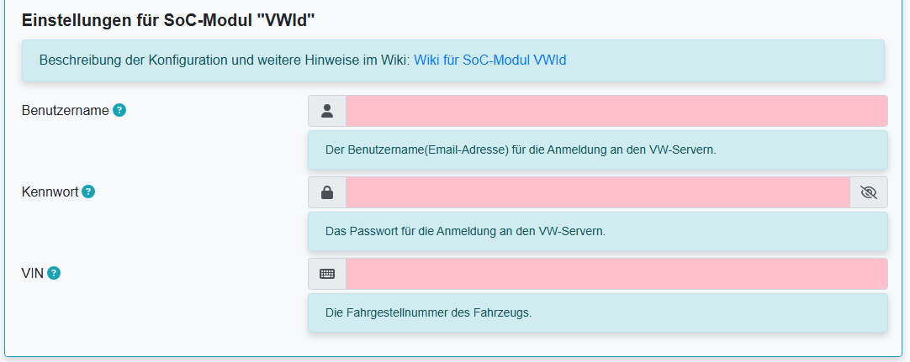

# SoC-Modul VWId

Das SoC-Modul VWId gibt es in openWB 1.x und 2.x
Die Konfiguration ist in beiden Varianten sehr ähnlich:

## Konfiguration in openWB 1.x

Die Konfiguration in openWB 1.x erfolgt im Bereich Einstellungen - Modulkonfiguration - Ladepunkte:

 

## Konfiguration in openWB 2.x
Die Konfiguration in openWB 2.x erfolgt im Bereich Einstellungen - Konfiguration - Fahrzeuge:

 

## Hinweise
Erfolgreich getestet u.a. für folgende Fahrzeuge: ID3, ID4, ID5, ID7, eGolf, Golf 8 GTE, Passat GTE, eUP, T7 Multivan eHybrid.

Für nicht-VW Fahrzeuge (Audi, Skoda, etc.) funktioniert das Modul nicht.

**Wichtig für alle Fahrzeuge:**
Es muss ein aktives Konto in myVolkswagen vorhanden sein und die "Volkswagen App" muss eingerichtet sein.

**WICHTIG:**
VW ändert gelegentlich die Bedingungen für die Nutzung der Online-Services.

Diese müssen bestätigt werden. Wenn der SOC-Abruf plötzlich nicht mehr funktioniert, VOR dem Posten bitte Schritt 1 ausführen.

Bei Problemen zunächst bitte diese Schritte durchführen:

1. sicherstellen, dass auf diesen VW-Seiten alle Einverständnisse gegeben wurden.

    <https://www.volkswagen.de/de/besitzer-und-nutzer.html>

    <https://vwid.vwgroup.io/landing-page>

    In einigen Fällen wurden die Einverständnisse gegeben und trotzdem funktionierte die Abfrage nicht.
    Hier hat folgendes Vorgehen geholfen: Im Volkswagen Konto das Land temporär umstellen, d.h.
    - auf ein anderes Land als das eigene ändern
    - sichern
    - zurück auf das eigene Land ändern
    - sichern.

2. Nach einem manuellen SOC-Abruf (Kreispfeil hinter dem SOC klicken) auf der Status - Seite EV-SOC Log und Debug log auf Fehler kontrollieren
3. Falls im Ev-SOC Log ein fehlendes Modul gemeldet wird, z.B.

    `ImportError: No module named 'lxml' (LV0)`
    - in openWB 1.9 sicherstellen, dass 1.9.304 (Nightly) installiert ist.
    - einen Reboot durchführen (Einstellungen - System - Reboot, Fahrzeug dazu abstecken!)
    Bei dem Neustart sollten fehlende Module installiert werden.
    Falls das nicht hilft gibt es den Support im Forum; dazu den Log der Startphase (1.9: Debug Log, 2.x Main Log) als code block (</>) posten.
4. Falls im log evcc erwähnt wird: von VW ID (alt) auf VW ID umstellen.
5. Falls im Ev-Soc Log Fehler 303 (unknown redirect) gemeldet wird:
    - Ursache 1: Bestimmte Sonderzeichen im Passwort funktionieren nicht mit dem Modul. Bitte das Passwort auf eines ohne Sonderzeichen ändern und testen.
    - Ursache 2: Falsche Email, Passwort oder VIN eingegeben. Alle 3 löschen, speichern, neu eingeben, speichern und testen.
6. Falls eine Firewall im Spiel ist: Es gab einzelne Probleme beim Internet-Zugriff der openWB auf Python Archive und Fahrzeug-Server wenn IPV6 aktiv ist.
7. Nach Neustart bzw. Änderung der LP-Konfiguration werden im EV-Soc-Log Fehler ausgegeben (permission oder fehlende Datei).

    Diese Fehler sind normal und können ignoriert werden. Leider wird im Debug Mode 0 keine Positiv-Meldung ausgegeben.
    Empfehlung:
    - In Einstellungen - System - Debugging dies einstellen: Debug Mode 1/Regelwerte
    - dann einen manuellen SOC-Abruf durchführen (im Dashboard auf Kreispfeil klicken).
    - danach sollte im EV-SOC-Log eine Zeile ähnlich dieser kommen:

        `2023-02-12 11:57:14 INFO:soc_vwid:Lp1 SOC: 61%@2023-02-12T11:53:20`

        Diese Zeile zeigt folgende Information:

        `2023-02-12 11:57:14       - Timestamp des SOC-Abrufs`

        `INFO                      - Debug Level INFO`

        `soc_vwid                  - SOC-Modul`

        `Lp1                       - Ladepunkt`

        `SOC: 61%                  - SOC Stand`

        `@2023-02-12T11:53:20      - Timestamp des Updates vom EV zum VW Cloud-Server`

8. Falls diese Schritte nicht zum Erfolg führen, das Problem im [Support Thema](https://forum.openwb.de/viewtopic.php?t=4803) posten mit Angabe relevanter Daten
    - oWB SW Version
    - oWB gekauft oder selbst installiert
    - wenn selbst installiert: welches OS(Stretch/Buster)
    - welches Fahrzeug
    - falls vorhanden Angaben über Firewall, VPN, etc., also Appliances, die den Internetzugang limitieren könnten
    - relevante Abschnitte der Logs, vor allem Fehlermeldungen, als CODE-blocks (</>).

Das SoC-Log mit evtl. Fehlermeldungen kann wie folgt eingesehen werden:
  - openWB 1.x (Status - EV SoC Log)
  - openWB 2.x (Einstellungen - System - Fehlersuche)

