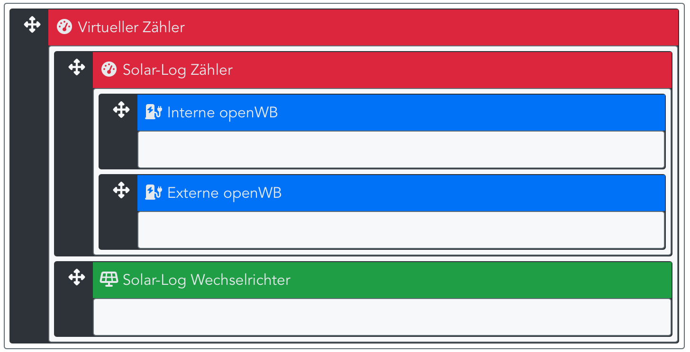

Solar-Log Zähler sind Hausverbrauchs-Zähler. Die für die Reglung erforderlichen Werte des EVU-Punkts werden mit einem virtuellen Zähler ermittelt. Die Komponenten müssen in der Hiarchie wie in der Abbildung angeordnet werden:

