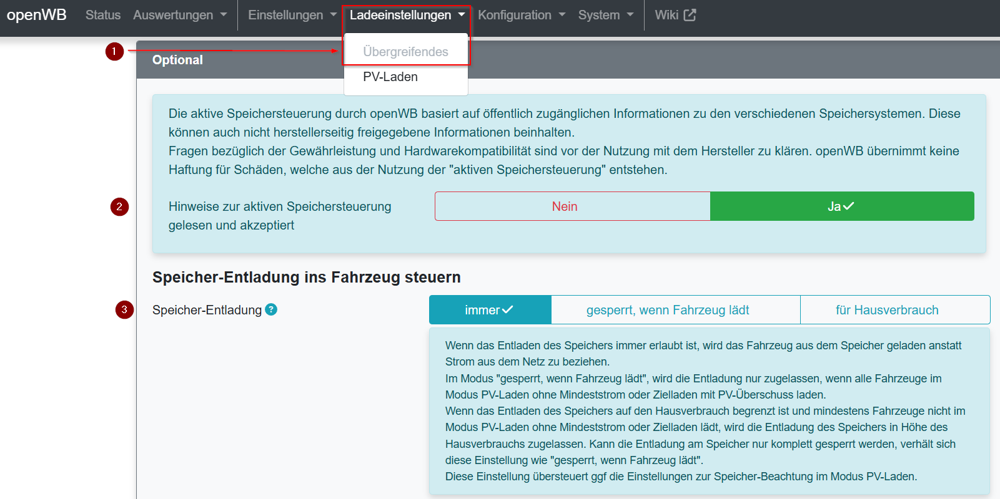

# Speichersteuerung openWB

 Um die Speicher-Entladung ins Fahrzeug zu steuern muss zunächst unter "Ladeeinstellungen -> Übergreifendes" die Speicher-Entladung ins Fahrzeug konfiguriert werden:

 

## SolarEdge und Mindest-SoC bzw. SoC-Reserve

SolarEdge entlädt nicht alle Speicher bis 0%, sondern nur bis zu einem Mindest-SoC (Ab hier als SoC-Reserve bezeichnet). Um Probleme bei der Speichersteuerung mit SolarEdge zu verhindern, muss diese SoC-Reserve der openWB bekannt sein. Bei Unterschreiten dieser SoC-Reserve erfolgt ggf. eine Zwangsladung des Speichers durch das SolarEdge Portal, um die Tiefentladung des Speichers zu verhindern. Diese kann nur erfolgen, wenn die Speichersteuerung durch openWB beendet wurde.  
Die SoC-Reserve ist je nach verwendetem Speicher unterschiedlich. Bei BYD LVS Speichern beträgt sie z.B. meist 10%, kann je nach Typ aber auch  bei 15% liegen. Einige LG-Speicher verwenden 5% und die HomeBattery von SolarEdge kann bis zu 0% entladen werden.  
Um einen zusätzlichen Konfigurationsaufwand pro Speicher zu vermeiden, verwendet die Speichersteuerung als Default-Wert für die SoC-Reserve 15%. Nach einem Reboot der openWB wird nun ständig der SoC-Wert des Speichers überwacht und bei Auftreten eines geringeren Wertes als 15% wird dieser als SoC-Reserve übernommen. Nach einem Neustart wird der gelernte Wert wieder verworfen, damit im Fehlerfall nicht ein falscher Wert dauerhaft erhalten bleibt.  
Dies führt dazu, dass sich nach einem Neustart der openWB die Speichersteuerung sicherheitshalber bei 15% beendet, wenn noch kein niedrigerer Wert gelernt wurde. In diesem Fall wird dann der Rest vom Speicher, wie in der Standardkonfiguration, immer ins Fahrzeug entladen. Wenn dies einmal erfolgt ist, bleibt die neu gelernte SoC-Reserve bis zum nächsten Neustart erhalten.

### Backup-Modul
Systeme mit einem Backup-Modul können mit einer Backup-Reserve konfiguriert werden, die für den Backup-Fall reserviert bleibt. Wenn diese Konfiguration erfolgt ist, so hat sie Vorrang vor dem oben beschriebenen Vorgang und wird immer berücksichtigt.

Feedback gerne im Forum:  
https://forum.openwb.de/viewtopic.php?t=9934