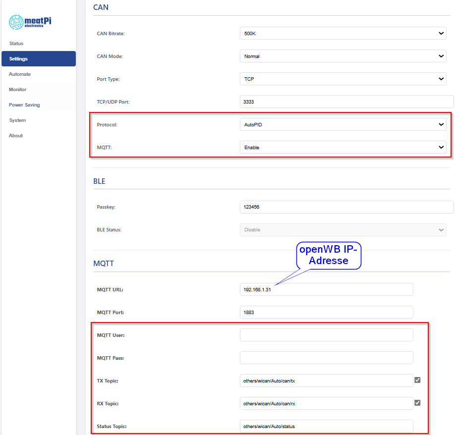
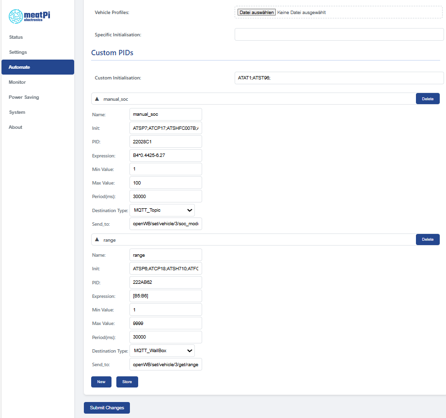

# WiCAN-OBD2 mit manuellem SoC Modul der openWB

Mit Hilfe des WiCAN OBD2 Dongles von meatPi Electronics können die Werte des Fahrzeugs über die OBD2-Schnittstelle ausgelesen und im WLAN per MQTT an die openWB Wallbox gesendet werden.
In Verbindung mit dem manuellem SoC Modul der openWB ist hiermit die Nutzung ohne Cloud-Dienste der Fahrzeughersteller möglich.
<https://github.com/meatpiHQ/wican-fw>

Die erste Umsetzung erfolgte von zut im openWB Forum, der hierfür auch eine Unterstützung von Spritmonitor umgesetzt hat. Hierfür ist ein weiteres Gerät im Netzwerk nötig, auf dem ein kleines Programm (soc_helper) laufen kann:
<https://forum.openwb.de/viewtopic.php?t=7451>

Im Laufe der weiteren Entwicklung wurde die Möglichkeit des automatischen Auslesen (AutoPID) in die Firmware des Gerätes integriert. Hierfür ist nun keine zusätzliche Hardware mehr nötig, da der Dongle die Daten direkt per MQTT an die openWB sendet. Die Unterstützung von Spritmonitor ist hiermit jedoch nicht möglich. Die Einrichtung dieser Funktion soll hier näher beschrieben werden.

## 1. Voraussetzungen

* WiCAN Dongle mit Firmware 3.48, 4.03 oder neuer (4.00 ist fehlerhaft).
* Konfiguration des Manuellen SoC Moduls im Fahrzeug der openWB.
* WLAN Empfang im Bereich der openWB bzw. des Fahrzeugs.
* Ggf. Beachtung einer Alarmanlage, die den OBD2 Port überwacht.

## 2. WiCAN Dongle

Die Beschaffung der Hardware ist zunächst die größte Hürde, da die Firma meatPi Electronics Ihren Sitz in Australien hat.
Es sind aktuell 2 Bezugsquellen bekannt:
<https://github.com/meatpiHQ/wican-fw?tab=readme-ov-file#order-on-mouser-or-crowd-supply>
Es ist hierbei darauf zu achten, dass nur der WiCAN-OBD2 oder der WiCAN PRO (Coming soon) verwendet werden kann. Bei Bestellung über Mouser erfolgt der Versand ab 50€ Versandkostenfrei, so dass sich idealerweise 2 oder mehr Besteller zu einer Sammelbestellung zusammentun können.
Achtung: Die angegeben Preise sind Nettopreise.

## 3. Konfiguration manueller SoC in openWB

* In der Fahrzeugkonfiguration der openWB muss das manuelle SoC Modul eingerichtet werden. Für die spätere Konfiguration der MQTT-Topics wird die Fahrzeug-ID benötigt. Diese kann man am besten auf der Status Seite der openWB auslesen:

  

## 4. Konfiguration WiCAN Settings

* Zunächst muss der WiCAN ins Heim-WLAN geholt werden:
<https://meatpihq.github.io/wican-fw/config/wifi>

* Nun werden die weiteren Parameter konfiguriert:

* Protocol AutoPID wird zur automatischen Abfrage der PIDs benötigt (Bereich Automate)
* MQTT zur openWB erfolgt mit leerem User und Passwort
* RX und Status Topic müssen mit others/ beginnen, damit sie von openWB beachtet werden. Diese dienen nur der Fehleranalyse und Überwachung mit MQTT-Explorer. Für die eigentliche Funktion werden sie nicht benötigt.

---

* Sleep Mode (Bereich Power Saving): Bei Unterschreiten der Sleep Voltage schaltet sich der WiCAN ab. Hierdurch wird ein Entladen der 12V Batterie verhindert.

## 5. Ermittlung der PID Parameter aus dem Vehicle Profile bei meatPi

Es werden bei meatPi die benötigten Parameter verschiedener Fahrzeuge in Vehicle-Profilen gesammelt.
Die Informationen aus diesen Profilen können wir verwenden, um die Parameter, die wir für die openWB benötigen, zu ermitteln.

Die Profile sind hier einzeln verfügbar:
<https://github.com/meatpiHQ/wican-fw/tree/main/vehicle_profiles>

Anhand des Beispiels eines VW:ID, die wichtigen Informationen (fettgedruckt).
Wir benötigen zwingend den SoC, optional können wir auch die Reichweite (Range) gebrauchen:

---
{
   "car_model":"VW: ID",
   **"init":"ATST96;ATFCSD300000;ATFCSM1;",**
   "pids":[
      {
         **"pid":"22028C1",**
         **"pid_init":"ATSP7;ATCP17;ATSHFC007B;ATFCSH17FC007B;ATCRA17FE007B;",**
         "parameters":[
            {
               "class":"battery",
               **"expression":"B4\*0.4425-6.1947",**
               **"name":"soc",**
               "unit":"%"
            }
         ]
      },
      {
         **"pid":"222AB62",**
         **"pid_init":"ATSP6;ATCP18;ATSH710;ATFCSH710;ATCRA77A;",**
         "parameters":[
            {
               "class":"none",
               **"expression":"[B5:B6]",**
               **"name":"range",**
               "unit":"km"
            }
         ]
      }

## 6. Übernahme der Werte für die Custom PIDs (Automate-Tab)

die gefundenen Werte werden nun im Bereich Automate bei den Custom PIDs eingetragen:

* Das Feld "Custom Initialization" wird aus "**init**" vom Vehicle-Profile übernommen.
* Das Feld Name muss für den SoC "manual_soc" lauten, für die Reichweite "range".
* Falls vorhanden wird das Feld "Init" aus "**pid_init**" vom Vehicle-Profile  übernommen. Dieses Feld kann auch leer sein, wenn für die einzelnen PIDs keine besondere Initialisierung benötigt wird.
* Das Feld PID wird aus "**pid**" übernommen.
* Das Feld Expression wird aus "**expression**" übernommen.
* Period(ms) ist das Intervall, in denen die Werte abgefragt werden.
* Im Feld "Destination Type" muss für den SoC "MQTT_Topic", für die Reichweite jedoch "MQTT_Wallbox" eingestellt werden.
* Im Feld Send_to muss die Fahrzeug ID aus der openWB, die wir in [Punkt 3](#3-konfiguration-manueller-soc-in-openwb) ermittelt haben, eingesetzt werden (...vehicle/**x**/...):

Die Werte lauten für den SoC:
openWB/set/vehicle/**x**/soc_module/calculated_soc_state
Für die Reichweite:
openWB/set/vehicle/**x**/get/range

Das Ergebnis sieht dann z.B. so aus:

Name|Init|PID|Expression|Period(ms)|Type|Send_to
-|-|-|-|-|-|-
manual_soc|ATSP7;ATSHFC007B;ATCP17;ATCRA17FE007B;ATFCSH17FC007B;|22028C1|B4*0.4425&#x2011;6.1947|10000|MQTT_Topic|openWB/set/vehicle/**3**/soc_module/calculated_soc_state
range|ATSP6;ATSH710;ATCP18; ATCRA77A;ATFCSH710;|222AB62|[B5:B6]|10000|MQTT_Topic|openWB/set/vehicle/**3**/get/range

### Ergänzung zur openWB 1.9

Bei openWB 1.9 wird das SOC Modul Manuell+Berechnung am Ladepunkt konfiguriert, das Topic benötigt hier den Typ MQTT_Wallbox.
Am Beispiel Ladepunkt 1 würde dies dann so aussehen:

Name|Init|PID|Expression|Period(ms)|Type|Send_to
-|-|-|-|-|-|-
manualSoC|ATSP7;ATSHFC007B;ATCP17;ATCRA17FE007B;ATFCSH17FC007B;|22028C1|B4*0.4425&#x2011;6.1947|60000|MQTT_Wallbox|openWB/set/lp/**1**

Nachtrag: openWB 1.9 akzeptiert nur Ganzzahlige SOC-Werte und kann daher aktuell nicht verwendet werden.

## 7. Alarmanlage des Fahrzeugs

Bei Fahrzeugen mit einer Alarmanlage wird häufig auch der OBD2-Port überwacht, so dass bei einer Abfrage die Alarmanlage auslöst.
Um dieses Problem zu umgehen sind momentan folgende Lösungen bekannt:

* Bei einigen Fahrzeugen liegt an PIN1 des OBD2-Ports nur bei eingeschalteter Zündung eine Spannung von 12V an. Diese kann dann zur Versorgung des WiCAN Dongles verwendet werden, so dass dieser bei abgeschalteter Zündung gar keine Spannungsversorgung hat. Normalerweise liegt an PIN16 die Versorgungsspannung für den WiCAN an.
Es kann also in diesem Fall mit einem entsprechend "manipuliertem" Adapterkabel z.B. PIN1 und PIN16 getauscht werden:
<https://forum.openwb.de/viewtopic.php?p=115467#p115467>
* Ggf. ist eine Anpassung der OBD2-Überwachung der Alarmanlage möglich:
<https://www.born-forum.de/forum/thread/193-m%C3%B6gliche-codierungen-am-cupra-born-ohne-gew%C3%A4hr-auf-eigene-gefahr/?postID=77395#post77395>

Beide Lösungen dienen nur zur Info und erfolgen stets auf eigene Gefahr

## 8. Übersicht erfolgreich getesteter Fahrzeuge

Abschliessend noch eine kurze Auflistung von bereits erfolgreich getesteten Fahrzeugen.
Gerne kann und sollte diese Liste erweitert werden.
Zur besseren Übersicht  werden hier nur die tatsächlich verwendeten Fahrzeuge (am besten mit Modelljahr) sowie nur der SoC aufgeführt:

Fahrzeug|Custom Initialization|Name|Init|PID|Expression
-|-|-|-|-|-
CUPRA&#160;Born&#160;2022|ATST96;ATFCSD300000;ATFCSM1;|manual_soc|ATSP7;ATCP17;ATSHFC007B;ATFCSH17FC007B;ATCRA17FE007B;|22028C1|B4*0.4425&#x2011;6.1947
Hyundai&#160;Ioniq&#160;(28&#160;kWh)&#160;2017|ATSP6;ATSH7E4;ATST96;|manual_soc||2105|B39/2
Peugeot iOn|ATSP6;ATFCSH761;ATFCSD300000;ATFCSM1;ATSH761;ATCRA762;|manual_soc||2101|(B4/2)&#x2011;5

Anmerkungen zur Tabelle:

Um einen Zeilenumbruch zu verhindern, müssen Leerzeichen durch einen "no-break space character" (\&#160;) und ein Minuszeichen durch "no-break hyphen" (\&#x2011;) im Markdown Quelltext ersetzt werden.
