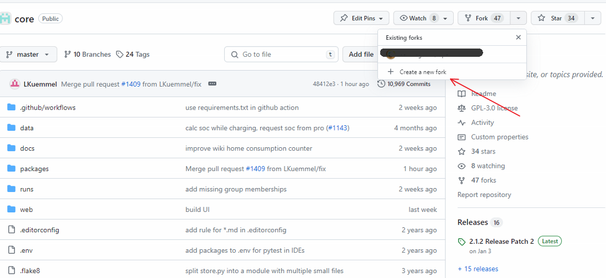

Wiki-Beiträge werden per Pull Request beigesteuert. Im Ordner ./docs des Core-Repository sind die Dateien des Wikis im Markdown-Format enthalten. Nach dem Merge des Pull Requests werden die Änderungen aus dem docs-Ordner mit dem Wiki per GitHub-Workflow automatisch synchronisiert.

Der Name der Markdown-Datei ist der Titel der Wiki-Seite. Die Datei _Sidebar.md enthält die Einträge, die rechts in der Sidebar des Wikis angezeigt werden.

### Ablauf mit Github

Wenn ihr euch am Wiki beteiligen wollt müsst ihr zunächst einen Github Account erstellen bzw. euch mit eurem anmelden. Dann geht ihr auf die [Projektseite](https://github.com/openWB/core) und erstellt einen Fork:

Dies ist nötig, da dem "normalen Mitarbeiter" das Projekt nicht gehört und man somit keine Schreibrechte im Projekt des OpenWB Accounts hat. Man erstellt also eine verknüfpte Kopie in seinem eigenen Account.
