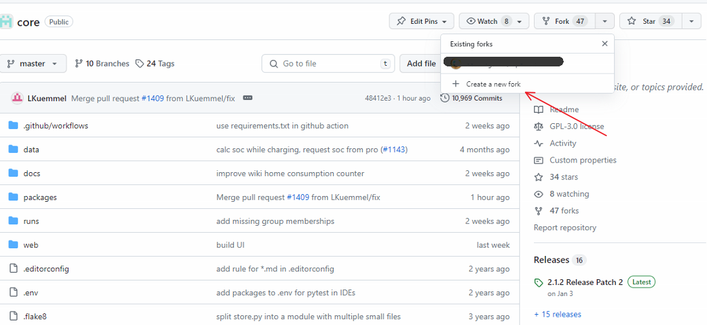
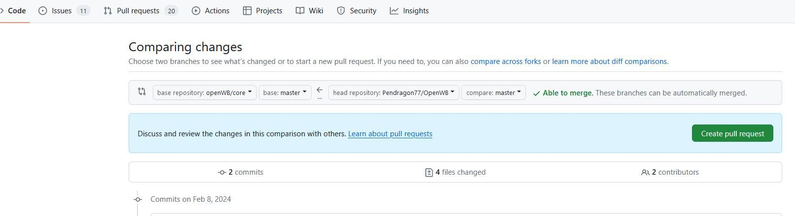

Wiki-Beiträge werden per Pull Request beigesteuert. Im Ordner ./docs des Core-Repository sind die Dateien des Wikis im Markdown-Format enthalten. Nach dem Merge des Pull Requests werden die Änderungen aus dem docs-Ordner mit dem Wiki per GitHub-Workflow automatisch synchronisiert.

Der Name der Markdown-Datei ist der Titel der Wiki-Seite. Die Datei _Sidebar.md enthält die Einträge, die rechts in der Sidebar des Wikis angezeigt werden.

### Ablauf mit Github

Wenn ihr euch am Wiki beteiligen wollt müsst ihr zunächst einen Github Account erstellen bzw. euch mit eurem anmelden. Dann geht ihr auf die [Projektseite](https://github.com/openWB/core) und erstellt einen Fork:

Dies ist nötig, da dem "normalen Mitarbeiter" das Projekt nicht gehört und man somit keine Schreibrechte im Projekt des OpenWB Accounts hat. Man erstellt also eine verknüfpte Kopie in seinem eigenen Account.
Hier wird dann am besten ein Branch erstellt, den ihr sinnvoll benennt (z.B. Wiki oder ähnlich). In diesem Branch arbeitet ihr und ändert und ergänzt entsprechend euren Erfahrungen zu den Themen in denen ihr euch auskennt. Danach müsst ihr Änderungen mit *Commit* in die (lokale) Git-Umgebung übernehmen und mit *Push* zu Github übertragen.
Dies beginnt ihr in eurem eigenen Branch und wählt im Menü oben Pull-Request aus und füllt die Felder mit einer Beschreibung was ihr gemacht habt.

Für euren ersten Beitrag müsst ihr noch von einem Projektmitarbeiter freigeschaltet werden. Dies kann einige Zeit dauern. Eventuell werden auch noch Änderungen vorgeschlagen, die ihr dann diskutieren oder einfach annehmen könnt.
