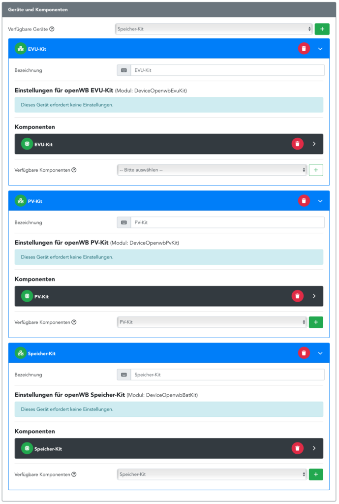

# Zähler

openWB benötigt zum erfolgreichen PV-Überschussladen die entsprechenden Zählerwerte am EVU-Punkt (EVU=Elektrizitätsversorgungsunternehmen), sprich dem Übergang ins öffentliche Netz. An dieser Stelle muss die Gesamtleistung saldierend erfasst werden. Für eine phasenbasierte Leistungsüberwachung sind auch die einzelnen Ströme und/oder Leistungen der drei Phasen notwendig. Bei einem Zähler im Hausverbrauchs-Zweig muss die Konfiguration wie [hier](https://github.com/openWB/core/wiki/Hausverbrauchs-Zähler) beschrieben erfolgen.

Im einfachsten Fall geschieht dies durch Kauf und Einbau eines [EVU-Kits](##EVU-Kit). Sollten schon digital auslesbare Zähler vorhanden sein, so besteht die Möglichkeit diese Werte an openWB weiterzuleiten, auch mit Hilfe von Hausautomationsservern.

Es gibt viele verschiedene Möglichkeiten, Zähler als auch Wechselrichter in das openWB-System einzufügen.  Die Struktur der Zähler muss dann im  [Lastmanagement](https://github.com/openWB/core/wiki/Lastmanagement-und-kaskadierte-Zähler) dem System bekanntgegeben werden. Hier können auch [virtuelle Zähler](##Virtuelle Zähler)  hinzugefügt werden, welche openWB-intern die untergeordneten Zähler verrechnen.

## EVU-Kit

Das [EVU-Kit (Link zum Shop)](https://openwb.de/shop/?product=openwb-evu-kit) ist die einfachste Art in der Software einen Zähler an die openWB zu integrieren. Der Zähler muss von einem Elektriker direkt hinter dem Zähler des EVU in den Zählerschrank integriert werden. Es gibt, je nach Kapazität des Hausanschlusses, verschiedene Messvarianten des Zählers, welche sich von der Integration unterscheiden. Dies betrifft aber nur die Arbeit des Elektrikers.
Der Zähler kommuniziert mit der openWB über Ethernet. Die Kits sind so vorkonfiguriert, dass sie von der openWB Software automatisch gefunden werden, wenn ein entsprechendes Gerät mit Zählerkomponente angelegt wird. Es gibt auch für Wechselrichter und Speicher entsprechende Kits.

## MQTT

openWB hat einen MQTT-Broker integriert, welcher unter Port 1883 (ohne Verschlüsselung) und Port 8883 (mit Verschlüsselung) erreichbar ist. Benutzerauthentifizierung ist deaktiviert und auch nicht aktivierbar. Ein Zähler, welcher die benötigten Daten liefert muss sich mit diesem Broker verbinden und dort die Werte unter den entsprechenden Topics publishen.

Folgende Werte können dem MQTT-Zähler übergeben werden. Die ID ist individuell und wird beim Anlegen der MQTT-Komponente angezeigt.
Die folgenden Topics sind für einen reibungslosen Betrieb unbedingt erforderlich:

- **openWB/set/counter/id/get/power**
  - **Beschreibung**: Bezugsleistung in Watt, Zahl mit oder ohne Nachkommastellen (Float, Integer) und einem Punkt als Dezimaltrennzeichen, positiv für Bezug, negativ für Einspeisung.
  - **Beispiel**: `-123.45`

- **openWB/set/counter/id/get/imported**
  - **Beschreibung**: Bezogene Energie in Wh, Zahl mit oder ohne Nachkommastellen (Float, Integer) und einem Punkt als Dezimaltrennzeichen, nur positiv.
  - **Beispiel**: `123.45`

- **openWB/set/counter/id/get/exported**
  - **Beschreibung**: Eingespeiste Energie in Wh, Zahl mit oder ohne Nachkommastellen (Float, Integer) und einem Punkt als Dezimaltrennzeichen, nur positiv.
  - **Beispiel**: `123.45`

Ströme je Phase sind für phasenbasiertes Lastmanagement unbedingt erforderlich, sonst erfolgt das Lastmanagement ausschließlich auf Basis der Gesamtleistung am EVU-Punkt:

- **openWB/set/counter/id/get/currents**
  - **Beschreibung**: Array mit den Strömen je Phase in Ampere, mit Nachkommastellen (Float), positiv für Bezug, negativ für Einspeisung.
  - **Beispiel**: `[1.2,2.3,-2.1]`

Die Netzfrequenz, Spannungen, Leistungen und Leistungsfaktoren jeder Phase werden ausschließlich zu Anzeigezwecken verwendet:

- **openWB/set/counter/id/get/frequency**
  - **Beschreibung**: Netzfrequenz in Hz, Zahl mit oder ohne Nachkommastellen (Float, Integer) und einem Punkt als Dezimaltrennzeichen.
  - **Beispiel**: `50.12`

- **openWB/set/counter/id/get/voltages**
  - **Beschreibung**: Array mit den Spannungen je Phase in Volt, mit Nachkommastellen (Float).
  - **Beispiel**: `[222.2,223.3,222.3]`

- **openWB/set/counter/id/get/powers**
  - **Beschreibung**: Array mit den Leistungen je Phase in Watt, mit Nachkommastellen (Float).
  - **Beispiel**: `[12.3,23.4,-12.3]`

- **openWB/set/counter/id/get/power_factors**
  - **Beschreibung**: Array mit den Leistungsfaktoren je Phase, mit Nachkommastellen (Float), Wertebereich -1 bis 1.
  - **Beispiel**: `[0.95,0.96,-0.95]`

## Huawei Wechselrichter mit DTSU666-H 250A und SDongle

Huawei Wechselrichter werden, in der Betriebsart mit Aufzeichnung des Hausverbraucht mit dem _DTSU666-H 250A_ Stromzähler direkt am EVU-Punkt betrieben. Die Kommunikation zwischen Zähler und Wechselrichter findet über RS485 statt. Sofern der Wechselrichter mit dem optionalen SmartDongle FE ausgestattet ist, können über diesen Daten des Wechselrichter ausgelesen werden.
Die Schnittstelle am Dongle ist Modbus-TCP. Dies muss mit Installer-Account am Wechselrichter auf "Unrestrictet" gestellt werden, damit die Daten extern abgerufen werden können.

Der Huawei-Wechselrichter kann direkt über die openWB ausgelesen werden.
Eine weitere Möglichkeit des Datenabrufs wird im [openWB-Forum](https://openwb.de/forum/viewtopic.php?t=7029) entwickelt und ist auf [Github](https://github.com/AlexanderMetzger/huawei_openwb_bridge) sowie der [Homepage des Entwicklers](https://lebensraum-wohnraum.de/openwb-kommunikation-mit-dem-huawei-wechselrichter-sun-2000/) zu finden. Hierbei wird das Image auf die SD-karte eines Raspberry-Zero gespiegelt und der Raspberry mit dem Config-WLAN des Wechselrichters verbunden. Die Skripte ziehen sich die entsprechenden Werte in Echtzeit vom Wechselrichter und publishen diese auf die [MQTT](#MQTT) Schnittstelle der openWB. Der Zähler in der openWB muss dementsprechend als MQTT-Zähler eingerichtet sein.

### Solaranzeige

[Solaranzeige](https://solaranzeige.de)  ist ebenfalls ein OpenSource Projekt, welches der Visualisierung, Speicherung und Weiterverarbeitung von PV-Daten dient.
Dieses Projekt unterstützt aktuell (Stand 2024-02) mehr Wechselrichter als openWB. Somit können hier mit etwas Aufwand existierende Wechselrichter eingebunden und die Daten weitergereicht werden, ohne Arbeiten am Zählerschrank durchzuführen zu lassen.
Die Software ist originär dafür vorgesehen auf einen Raspberry per Image installiert zu werden und nach wenigen Konfigurationsschritten lauffähig zu sein. Es gibt auch schon Portierungen für [Docker](https://github.com/DeBaschdi/docker.solaranzeige).
Solaranzeige kann mit vielen Wechselrichtern kommunizieren und auch teilweise die angeschlossenen Zähler auslesen. Eine zeitbasierte Datenbank (InfluxDb), Datenweitergabe über einen MQTT-Client sowie eine Visualisierung mit Grafana sind direkt integriert. Es kann aber auch bereits existierende Infrastruktur verwendet werden.
In dem Projekt wird (mit Stand von 2021) auch die Möglichkeit dokumentiert die Daten direkt an openWB weiterzuleiten. Dann kann jedoch kein weiterer MQTT-Broker bedient werden.
Alternativ können die Zählerwerte an eine Hausautomationsserver weitergegeben, dort ggf. vorzeichenkorrigiert und dann über einen zweiten MQTT-Client zur openWB geschickt werden.

## Virtuelle Zähler

Virtuelle Zähler sind, wie der Name schon sagt, nicht physikalisch vorhanden. Sie dienen in der Struktur des [Lastmanagement](https://github.com/openWB/core/wiki/Lastmanagement-und-kaskadierte-Zähler) dazu, Ströme und/oder Leistung zu begrenzen oder Werte aus untergeordneten einzelnen Zählern zu akkumulieren.

## Timing

Das zyklische Senden bzw. Bereitstellen der Zählerwerte ist für eine funktionierende Regelung essentiell. Unter ``Einstellungen - Allgemein - Hardware`` kann die Regelgeschwindigkeit ausgewählt werden. Es gibt die Intervalle:

- Normal
- Langsam (20s)
- Sehr langsam (60s)

Hier muss eine Regelgeschwindigkeit entsprechend der Aktualisierungsrate der Zählerwerte angegeben werden, da ansonsten die Rückmeldung des Systems zu spät kommt und die openWB weiter versucht nachzuregeln.
Insbesondere bei der Verwendung von [Solaranzeige](### Solaranzeige) ist aufgrund der 20-30s dauerenden Aktualisierungsrate die Regelungsgeschwindigkeit anzupassen.
